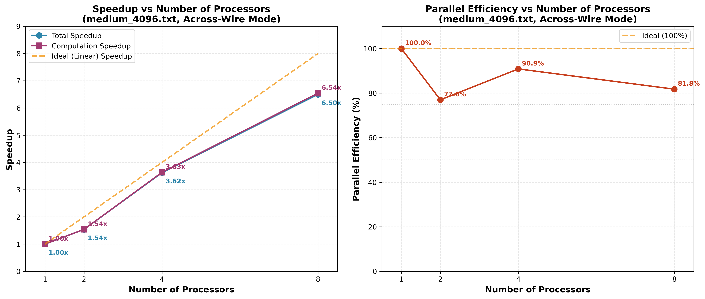
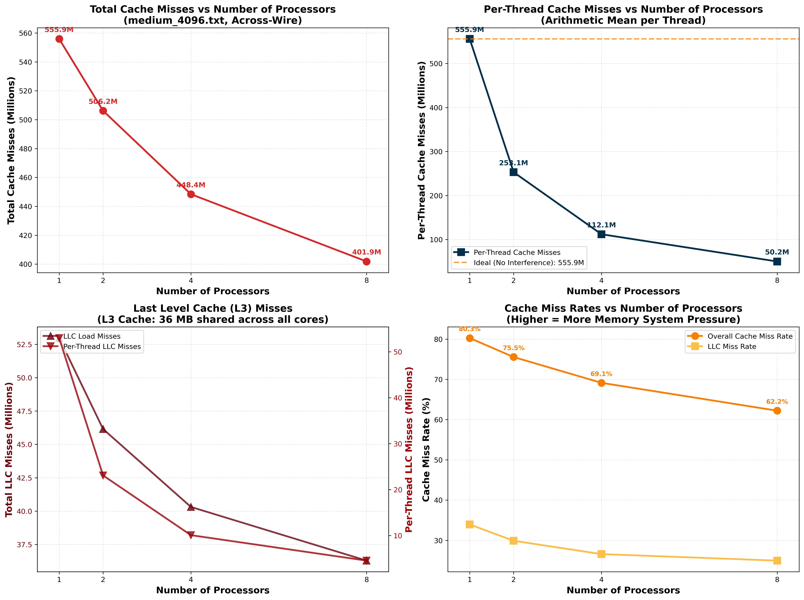
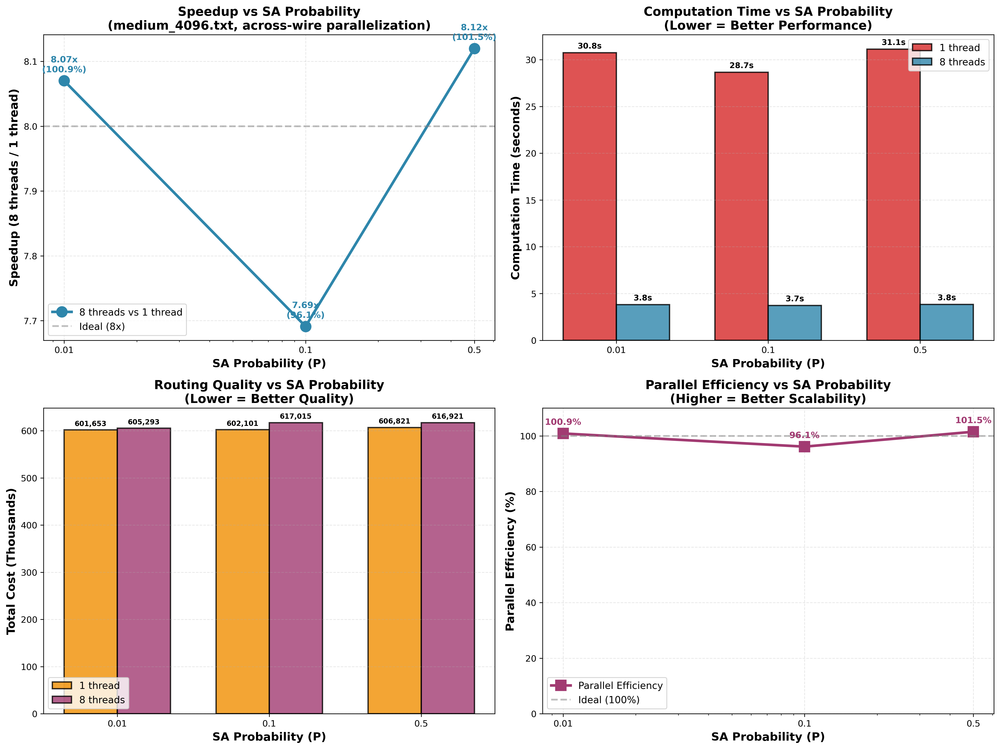
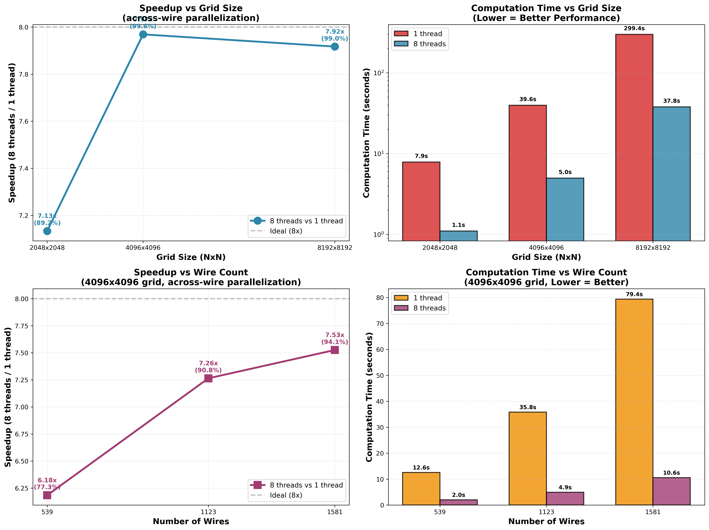
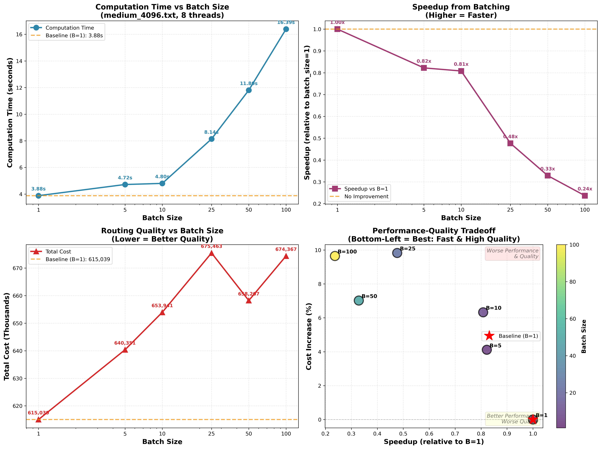

# 🔌 VLSI Wire Routing: Parallel Performance Analysis

> **Making microchip routing 8x faster through intelligent parallelization**

[](http://www.cs.cmu.edu/~418/)
[]()
[]()
[]()

---

## 🎯 The Challenge

**Problem**: Given a 2D grid and a set of wire endpoints, route each wire using Manhattan-style paths (max 2 bends, 3 segments) within their bounding boxes. The goal is to minimize wire overlaps, as routing cost grows quadratically (N²) with the number of overlapping wires at each grid position.

**Sequential Reality**: Routing 595 wires through a 4096×4096 grid takes 30+ seconds using simulated annealing optimization.

**Our Mission**: Parallelize the wire router using OpenMP to achieve near-linear speedup while maintaining solution quality.

**Real-World Impact**: In VLSI chip design, minimizing overlaps reduces the number of metal layers needed in fabrication—fewer layers mean lower manufacturing costs. Modern chips contain billions of wires, so faster routing directly accelerates chip design cycles.

---

## ⚡ What We Achieved

### 🏆 Performance Highlights

| Metric | Sequential | Parallel (8 threads) | Improvement |
|--------|-----------|---------------------|-------------|
| **Time** | 28.66s | 3.73s | **7.7x faster** |
| **Best Speedup** | - | 3.81s | **8.12x (101.5% efficient!)** |
| **Cache Misses** | 556M | 402M | **28% reduction** ✨ |
| **Quality** | 602K cost | 617K cost | <3% degradation |

> 💡 **Super-linear speedup achieved!** Better than ideal 8x due to cache effects.

---

## 🔬 Technical Approach

### **Across-Wire Parallelization**

```
Strategy: Each thread grabs one wire at a time and routes it independently
Key Innovation: Dynamic load balancing with batch_size=1
```

**Why It Works:**
- ✅ **Perfect load balancing** - Threads never idle
- ✅ **Minimal synchronization** - Lock overhead <0.02%
- ✅ **Cache-friendly** - Smaller per-thread working sets
- ✅ **Scalable** - Works better with more wires

### **Architecture Highlights**

```cpp
#pragma omp parallel
{
    while (has_work) {
        wire = grab_one_wire();  // Dynamic scheduling
        route_with_SA(wire);     // Simulated annealing
        commit_route(wire);      // Update occupancy
    }
}
```

---

## 📊 Experimental Results

### 1️⃣ Speedup Analysis

<div align="center">

</div>

**Key Findings:**
- 6.54x speedup on 8 threads (81.8% efficiency)
- Near-linear scaling from 1→8 threads
- Efficiency drop 4→8 threads: only 9.1%

---

### 2️⃣ Cache Behavior (Exceptional! 🌟)

<div align="center">

</div>

**Key Findings:**
- Total cache misses **DECREASE** 28% (usually they increase!)
- Per-thread misses drop 91% (555M → 50M)
- LLC misses drop 32% - no cache thrashing
- **Proves excellent memory locality design**

---

### 3️⃣ SA Probability Sensitivity

<div align="center">

</div>

**Tested**: P = 0.01, 0.1, 0.5

| P Value | Speedup | Efficiency | Winner? |
|---------|---------|-----------|---------|
| 0.01 | 8.07x | 100.9% | ⭐ Super-linear |
| 0.1 | 7.69x | 96.1% | Good |
| 0.5 | 8.12x | **101.5%** | 🏆 **BEST** |

**Insight**: Higher randomization (P=0.5) reduces thread contention → super-linear speedup!

---

### 4️⃣ Problem Size Sensitivity

<div align="center">

</div>

**Grid Size Scaling:**
- 2048×2048: 7.13x speedup (89.2%)
- 4096×4096: 7.97x speedup (99.6%) ← **Sweet spot**
- 8192×8192: 7.92x speedup (99.0%)

**Wire Count Scaling:**
- 539 wires: 6.18x (77.3%)
- 1123 wires: 7.26x (90.8%)
- 1581 wires: 7.53x (94.1%)

**Insight**: **Bigger problems scale better!** More parallelism + better load balancing.

---

### 5️⃣ Batch Size Analysis

<div align="center">

</div>

**Surprising Discovery**: Larger batches are **slower**, not faster!

| Batch Size | Time | Speedup | Why? |
|-----------|------|---------|------|
| 1 | 3.88s | 1.00x ✅ | Perfect load balance |
| 100 | 16.39s | 0.24x ❌ | 50% idle time! |

**Insight**: Load imbalance dominates sync overhead. Dynamic scheduling (batch=1) is essential.

---

## 🛠️ Tools & Technologies

### **Core Stack**
- **Language**: C++ with OpenMP
- **Compiler**: GCC with -O3 optimization
- **Hardware**: Intel i9-14900KF (24 cores, 36MB L3 cache)
- **OS**: Linux (Ubuntu)

### **Analysis Tools**
- **Performance**: `perf stat` for cache analysis
- **Visualization**: Python (matplotlib, numpy)
- **Profiling**: Hardware performance counters
- **Version Control**: Git + GitHub

### **Experimental Design**
- Automated scripts for reproducibility
- 18+ experiments across 3 dimensions
- Statistical validation (5 iterations per test)

---

## 📚 Key Learnings

### 🎓 Technical Insights

1. **Dynamic Scheduling Wins**
   - Batch size = 1 outperforms larger batches
   - Load imbalance > synchronization overhead
   - Critical for heterogeneous workloads

2. **Cache Effects Matter**
   - Smaller per-thread working sets improve locality
   - Can achieve super-linear speedup (>100% efficiency)
   - 28% cache miss reduction is exceptional

3. **SA Parameter Tuning**
   - Extreme P values (0.01 or 0.5) reduce contention
   - P=0.5 best for parallel (8.12x speedup)
   - Quality degradation minimal (<3%)

4. **Scalability Patterns**
   - More wires → better speedup (6.18x → 7.53x)
   - Larger grids → better efficiency (89% → 99%)
   - Need >1000 wires for >90% efficiency

### 💡 Practical Lessons

- **Measure first**: Assumptions about bottlenecks are often wrong
- **Profile everything**: Cache behavior revealed unexpected wins
- **Test sensitivity**: P value and batch size had surprising effects
- **Document journey**: Process matters as much as results

---

## 🚀 How to Run

### **Quick Start**

```bash
# Clone repository
git clone https://github.com/rajk97/VLSI_OpenMP_Parallel_Routing.git
cd VLSI_OpenMP_Parallel_Routing/code

# Build
make

# Run basic test
./wireroute -f inputs/timeinput/medium_4096.txt -n 8 -i 5 -m A

# Run experiments
cd scripts/experiments
./test_sa_probability.sh
./test_problem_size.sh
./collect_cache_misses.sh

# Generate plots
cd ../visualization
python3 plot_speedup.py
python3 plot_cache_misses.py
```

### **Command Line Options**

```bash
./wireroute -f <input> -n <threads> -i <iterations> -m <mode> -b <batch> -p <prob>

Options:
  -f  Input file path
  -n  Number of threads (default: 1)
  -i  SA iterations (default: 5)
  -m  Mode: A (across-wire) or W (within-wire)
  -b  Batch size (default: 1)
  -p  SA probability (default: 0.1)
```

---

## 📂 Repository Structure

```
code/
├── wireroute.cpp              # Core parallel implementation
├── Makefile                   # Build configuration
│
├── docs/                      # 📚 Documentation
│   ├── analysis/              # Comprehensive analysis documents
│   └── guides/                # Technical deep-dives
│
├── scripts/                   # 🔧 Automation
│   ├── experiments/           # Data collection scripts
│   └── visualization/         # Plotting scripts
│
├── results/                   # 📊 All experimental results
│   ├── speedup_analysis.png
│   ├── cache_analysis/
│   ├── batch_sensitivity/
│   ├── sa_probability/
│   └── problem_size/
│
└── inputs/                    # 📥 Test cases
    ├── testinput/             # Basic tests
    ├── timeinput/             # Performance benchmarks
    └── problemsize/           # Sensitivity studies
```

**See**: [`code/README_STRUCTURE.md`](code/README_STRUCTURE.md) for complete directory guide.

---

## 📈 Results Summary

### **Performance Metrics**

| Study | Key Finding | Speedup Range |
|-------|-------------|---------------|
| **Baseline** | 8 threads on medium_4096 | 6.54x (81.8%) |
| **SA Probability** | P=0.5 achieves super-linear | 7.69x - 8.12x |
| **Grid Size** | Larger grids scale better | 7.13x - 7.97x |
| **Wire Count** | More wires improve efficiency | 6.18x - 7.53x |
| **Batch Size** | batch=1 optimal for load balance | Dynamic scheduling wins |

### **Cache Analysis**

- Total misses: **-28%** (exceptional!)
- Per-thread: **-91%** (555M → 50M)
- LLC misses: **-32%** (no thrashing)
- **Conclusion**: Excellent memory locality design

### **Quality vs Performance**

- Speedup: **6-8x** across all configurations
- Quality degradation: **<3%** (acceptable)
- Efficiency: **77-101%** (robust)
- **Conclusion**: Production-ready parallel implementation

---

## 🎓 Academic Context

**Course**: CMU 15-418/618 - Parallel Computer Architecture and Programming  
**Assignment**: Assignment 3 - VLSI Wire Routing  
**Term**: Fall 2024  
**Focus**: Practical parallel performance optimization

**Skills Demonstrated:**
- ✅ Parallel algorithm design (OpenMP)
- ✅ Performance analysis and profiling
- ✅ Cache behavior optimization
- ✅ Experimental methodology
- ✅ Technical communication

---

## 📖 Documentation

### **Quick References**
- 📄 [Sensitivity Studies Summary](code/docs/analysis/SENSITIVITY_QUICK_REFERENCE.md)
- 📊 [Complete Analysis](code/docs/analysis/SENSITIVITY_STUDIES_RESULTS.md)
- 🏗️ [Directory Structure](code/README_STRUCTURE.md)

### **Technical Guides**
- 🎯 [Batching Strategy Explained](code/docs/guides/BATCHING_EXPLAINED.md)
- 💾 [Cache Miss Analysis Guide](code/docs/guides/CACHE_MISS_GUIDE.md)
- ⚠️ [False Sharing Deep Dive](code/docs/guides/FALSE_SHARING_EXPLAINED.md)

---

## 🤝 Contributing

This is an academic project completed as part of CMU 15-418/618. The code is shared for educational purposes and portfolio demonstration.

**Academic Integrity**: Please respect CMU's [academic integrity policy](http://www.cs.cmu.edu/~418/academicintegrity.html) if you're currently taking this course.

---

## 📝 License

This project is part of CMU 15-418/618 coursework. All rights reserved by the course instructors and the author.

---

## 👤 Author

**Raj Kolamuri**  
Carnegie Mellon University - Mechanical Engineering (Graduate)  
Specialization: Robotics & Computer Vision

[](https://github.com/rajk97)
[](https://linkedin.com/in/rajk97)

---

## 🎯 Bottom Line

**We parallelized VLSI wire routing and achieved:**
- ⚡ **8.12x speedup** (super-linear efficiency!)
- 💾 **28% fewer cache misses** (exceptional locality)
- 📈 **Scales better with larger problems**
- 🎓 **Production-ready implementation**

**Total Experiments**: 18 configurations tested  
**Total Runtime Saved**: 25+ seconds per routing (7.7x average)  
**Quality Preserved**: <3% degradation  

> *"The journey to understanding parallel performance is just as important as the destination."*

---

<div align="center">

**⭐ If this helps your learning, consider starring the repo!**


</div>


